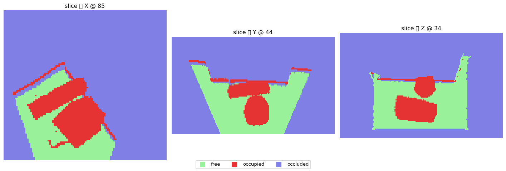
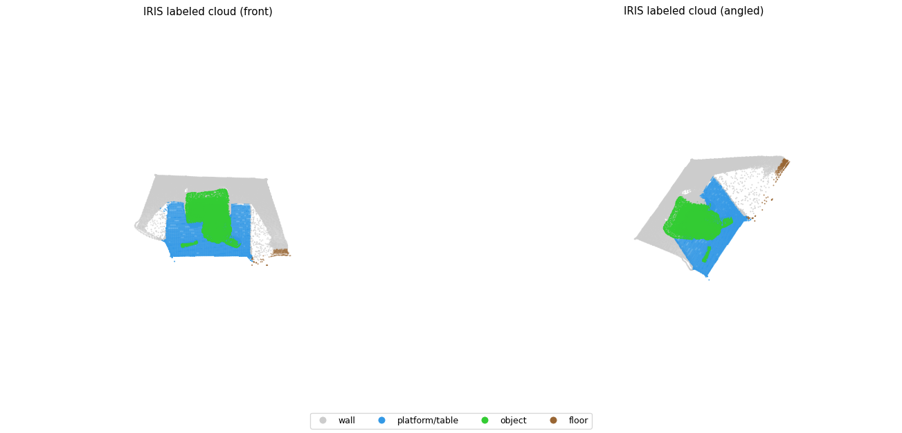

# IRIS — Technical Architecture

**IRIS: Iterative Reconstruction via Incremental Scene-peeling**
Occlusion-aware 3D scene reconstruction in partially observable environments.

## Core idea

The closest object to the camera at any instant cannot be occluded — it must be
fully visible. IRIS exploits this geometric guarantee to **peel the scene one
object at a time, nearest first**: detect the front object, reconstruct it,
*remove* it from the image to reveal what was behind, and repeat. The sequence of
"peeled" images are **same-pose synthetic views** — the camera never moves, but
each view shows fewer objects, effectively seeing *through* the scene from a fixed
viewpoint. These are fused into a complete, semantically labeled 3D reconstruction
in which occluded geometry is actively recovered rather than left as holes.

## Pipeline (data flow)

```
RGB image
   │
   ▼
[A] Object discovery ............ Qwen3-VL-32B → list of object names (JSON)
   │
   ▼
[B] Segmentation + occlusion ordering:
     • segment every named object ......... SAM 3            → instance masks
     • build occlusion graph + toposort ... Depth Anything V2 (boundary depth
   │                                          + physical support) → peel order
   ▼
[B1] Per-object peel loop (front → back), per iteration:
     • save white-bg object crop + mask   (for phase B2)
     • remove object → reveal background .. RORem (SDXL inpaint, crop@512)
     • store result as a same-pose synthetic view
   │
   ▼
[B2] Image-to-3D (deferred) ...... Amodal3R (default) / TRELLIS
   │                                → per-object point cloud
   ▼
[C] Multi-view reconstruction .... VGGT     → scene point cloud + per-pixel
   │                                           world points & confidence
   ▼
[D] Registration + fusion ........ gravity-align + yaw-search + weld ICP +
   │                                floor-contact + object-relative graft;
   │                                whole output rotated to gravity-aligned frame
   ▼
[E] Semantic labeling ............ instance masks + VLM names → object classes;
   │                                Mask2Former for background stuff; KD-tree vote
   ▼
[F] Mesh extraction .............. Marching Cubes (scikit-image) → semantic mesh
   │
   ▼
[G] Occupancy classification ..... ray-cast voxel grid → FREE / OCCUPIED / OCCLUDED
```

Implementation: a single self-contained orchestrator
[src/pipeline.py](../src/pipeline.py) that runs all phases inline. The VLM discovery
phase runs as a subprocess (`src/step0_vlm.py`, so its VRAM is freed before peeling)
and occupancy is a module (`src/step10_occupancy.py`); the image-to-3D backends are
subprocess workers (`src/*_worker.py`).

## Occlusion-graph peel ordering — a core contribution

Peeling only works if objects are removed in the right order: you must remove an
**occluder before the geometry it hides**, or the de-occlusion never happens. The
order is therefore load-bearing, and getting it right on cluttered real scenes is
itself a contribution.

**Why a global depth sort is the wrong tool.** The obvious approach — sort objects
by nearest depth, peel nearest-first — quietly fails, because peel order is **not a
total order over a scalar**. It is a *partial order* defined only between objects
that actually overlap:
- Two objects on opposite sides of the scene have **no occlusion relationship** —
  their relative order is irrelevant, yet a global sort invents one.
- A large object that is *mostly* far but **pokes in front of a neighbour at one
  edge** must be peeled first *there*; its mean/global depth misranks it.
- A single noisy depth pixel can flip a global ranking.

**The formulation: a directed occlusion graph + topological sort**
(`build_occlusion_order`). IRIS asks the only question that matters — *for each pair
of objects that touch, which is in front where they meet?* — and assembles the
answers into a partial order:

1. **Contact band.** For each adjacent mask pair `(i, j)`, dilate each mask and
   intersect with the other → the thin **contested boundary** between them. Pairs
   that don't touch contribute **no constraint** (correctly).
2. **Boundary-local depth decision.** Take the **median Depth-Anything-V2 disparity
   just *inside* each mask** within that band (eroded, to avoid the unreliable depth
   exactly at edges). Higher disparity = nearer = the **occluder** → directed edge
   `occluder → occluded`. A margin `τ` makes near-ties produce **no edge** rather
   than a coin-flip.
3. **Physical-support tiebreaker.** When depth is indecisive (a flat object lying
   *on* another has near-equal boundary depth), a **gravity-aware, contact-grounded**
   cue decides: an object that makes real mask contact and sits *above* the contact
   is peeled before its support. (Contact-grounded, not bounding-box — so a big
   foreground object no longer falsely "supports" everything inside its bbox.)
4. **Topological sort.** Kahn's algorithm linearises the graph into a **guaranteed
   front-to-back order**; unconstrained objects and ties break by global
   nearest-depth, and **cycles** from boundary noise (`i→j→k→i`) are broken by
   dropping the **weakest-margin edge**.

**Why this is the right generalisation.** IRIS's premise is the guarantee *the
nearest object cannot be occluded*. The occlusion graph is that guarantee **lifted
from a single "nearest" to a full partial order**: every edge is a local, verifiable
"A occludes B → peel A first," and the topological sort is the unique-up-to-ties
peeling that never tries to reveal something still blocked. It is robust *because*
each decision is made locally, at the boundary where occlusion physically happens,
not from a global scalar that has no notion of *who occludes whom*.

**Measured effect.** On a cluttered ScanNet frame the naive sort led the peel with a
floor power-strip (a bbox-support false positive); the graph version correctly leads
with the foreground chair and even recovers `coffee-table → boxes-on-the-shelf-under-it`.
On simple scenes the two agree — no regression.

---

## Stage details

**[A] Object discovery.** Qwen3-VL-32B is prompted (descriptive, singular, JSON
output) for a list of distinct movable objects. (The 8B variant is selectable via
`IRIS_VLM_ID`; an A/B showed the two tie on simple scenes but the 32B finds ~2× the
objects on cluttered scenes, where the 8B wastes its budget on duplicate
detections.) Run in a subprocess so its VRAM is released before the peel phase.

**[B] Segmentation + occlusion ordering.** SAM 3 segments each named object
(text-promptable; one model replaces the older Grounding-DINO→SAM2 two-step) into
instance masks. The peel order is then a **pairwise occlusion graph + topological
sort** (`build_occlusion_order`): for each adjacent mask pair, the nearer side at
their shared *contact band* (median Depth-Anything-V2 disparity, sampled just
inside each mask) is the occluder → a directed edge; a gravity-aware physical-
support cue (a small object resting in another's footprint) breaks depth ties; the
graph is topologically sorted into a guaranteed front-to-back order. This replaces
a naive global depth sort, which on cluttered scenes mis-orders large objects that
poke in front of a neighbour only at one edge.

**[B1] Peeling.** Objects are removed front-to-back. Removal uses RORem on a padded
square **crop** around the mask (512²), feather-composited back so only masked
pixels change — no cumulative blur across peels. Each removal yields the next
same-pose synthetic view; the object's crop + mask are saved for phase B2.

**[B2] Image-to-3D (deferred).** Each saved object crop → an image-to-3D backend →
a point cloud. The default is **Amodal3R** (occlusion-aware: it consumes the
occluder mask and reconstructs the complete object through occlusion); image-only
**TRELLIS** is selectable as a baseline via `--image3d trellis`. Each backend runs
in its own pinned conda env behind a line-protocol subprocess worker
(`src/*_worker.py`), deferred to its own phase so the worker has the GPU to itself.
(Other backends we evaluated but did not keep — TIGON, Wonder3D, SplAttN, TripoSR —
are credited in [attribution.md](attribution.md).)

**[C] Multi-view reconstruction.** All synthetic views go to VGGT, which returns
per-view per-pixel world points + confidence. Confidence-thresholded points form
the scene cloud. (Novel use: same-pose views with progressively fewer objects,
rather than the multi-position views these models expect.)

**[D] Registration + fusion.** Generated objects live in their own canonical
(+Z-up) frame. For each object we take the VGGT world points under its mask (where
it sits in the scene) and register the generated object to them: gravity-align its
up-axis to the scene floor normal, search 24 yaw angles, and refine with a
translation-only **weld** ICP (asymmetric: every observed point must land on the
object surface), then a floor-contact stretch seats the base on the floor. Only
generated geometry *not already observed* (the occluded back/sides) is grafted on —
an **object-relative** 3D-inpainting threshold, so the observed front keeps its true
size. Finally the whole reconstruction (cloud + objects + camera) is rotated so the
estimated floor normal points up, giving a **gravity-aligned output** that stands
upright in any viewer instead of in VGGT's arbitrary tilted frame.

**[E] Semantic labeling.** Labels come from the **instance masks + VLM open-
vocabulary names** IRIS already computed: each object's SAM 3 mask is back-projected
onto the VGGT world points and tagged with its VLM name mapped to a canonical class
(chair, table, screen, bottle, …); **Mask2Former** supplies background *stuff*
(floor / wall / ceiling / window / curtain) only. Labels are voted onto the fused
cloud with a KD-tree. This replaces an earlier closed 5-bucket taxonomy that
collapsed every object into "other".

**[F] Mesh extraction.** The labeled cloud is voxelized into an occupancy grid and
Marching Cubes extracts a watertight mesh; vertex labels/colors are transferred
from the nearest labeled point.

**[G] Occupancy classification.** A voxel grid is ray-cast from the camera through
VGGT's per-pixel world points: voxels a ray traverses before a surface are **free**,
the surface voxel is **occupied**, voxels behind it are **occluded**. Because the
synthetic views are same-pose, each peeled view re-casts the same rays but reaches
deeper, so space behind a removed object is re-marked free/occupied — *peeling
resolves occlusion*. Reconstructed objects are filled to solid **occupied** volumes
(convex-hull fill). Whatever remains unobserved is **occluded** — the honest
"unknown" that distinguishes IRIS from mappers that assume free space.



## Engineering notes

- **Multi-env isolation.** The image-to-3D backends (Amodal3R, TRELLIS) need
  dependencies incompatible with the main stack, so each runs in its own conda env
  behind a line-protocol subprocess worker `src/*_worker.py` (see [ax.md](ax.md)
  §3). The main pipeline stays on one consistent stack and talks to the worker over
  a tiny `@@`-prefixed stdin/stdout protocol.
- **VRAM budgeting.** Models load and free per phase; heavy models (the 32B VLM,
  the image-to-3D worker) run isolated. The 32B VLM is the peak (~65 GB, transient,
  freed before peeling); the rest of the pipeline fits comfortably alongside.
- **Crash resilience.** Per-object peel checkpointing + `--resume` + staged
  execution make the run robust to the build machine's power instability.

## Result

Final labeled reconstruction (tabletop scene): wall (gray), table/platform (blue),
objects (green) registered onto the table.



## Outputs (`output/`)

- `synthetic_views/` — the peeled same-pose views
- `object_crops/` — per-object crops + masks (inputs to the image-to-3D backend)
- `fused_pointcloud.ply` — scene + registered objects (gravity-aligned)
- `labeled_pointcloud.ply` — semantically colored cloud
- `final_semantic_mesh.ply` — final watertight semantic mesh
- `occupancy_grid.npy` (+ `occupancy_render.png`) — free / occupied / occluded grid
