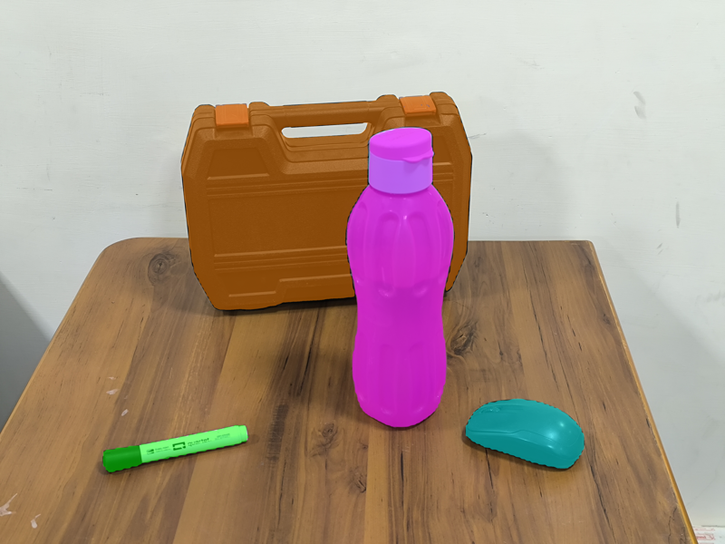
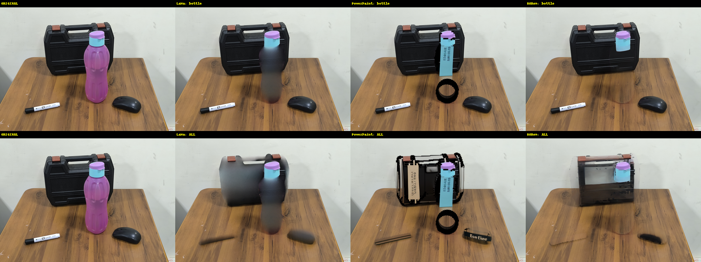
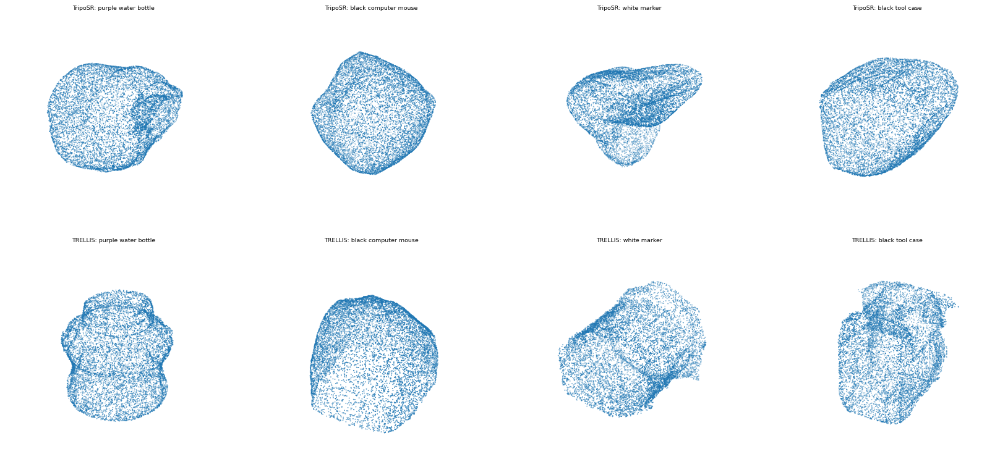

# KPIs & Evaluation

This document defines how IRIS is evaluated, the metrics used, and results
collected so far. It separates **diagnostic results we have measured** from the
**benchmark protocol** that produces the headline KPIs.

## Metrics

**Geometric reconstruction** (fused/meshed cloud vs. ground-truth mesh):
- **Accuracy** — mean/median distance from predicted points to GT surface (precision).
- **Completeness** — mean/median distance from GT surface to predicted points (recall).
- **F-score @ τ** — harmonic mean of precision/recall at threshold τ (e.g. 5 cm).
- **Normal consistency** — surface orientation agreement.

**Occlusion recovery** (the metric that targets the problem statement):
- **Occluded-surface recall** — of the GT surface that is *not visible* in the
  input view (occluded by a foreground object), what fraction does IRIS recover?
  This is what separates IRIS from full-visibility methods (Atlas) and from object
  shape-completion (SceneComplete).

**Semantic labeling.** IRIS now produces **open-vocabulary, instance-level** labels
(object classes from the VLM names + SAM 3 masks; background stuff from
Mask2Former), which map down to a fixed benchmark taxonomy (e.g. the ScanNet-20
classes) for scoring:
- **mIoU** and **per-class IoU** vs. GT labels.
- **Overall point accuracy**.

## Benchmark protocol

1. **Datasets** — ScanNet & ScanNet++ (indoor RGB-D, GT 3D + semantics); NYU
   Depth V2 (depth/scale); S3DIS (semantic labels). Objaverse is referenced for
   image-to-3D sanity but not for scene metrics.
2. **Per scene** — pick a camera view with real occlusion; run IRIS on that single
   RGB frame; **align the output to the GT mesh by pose-anchored registration** —
   the recon is seated using the *input* sensor camera pose (`T = c2w @ extrinsics0`)
   and refined with point-to-plane ICP. This is deterministic (no FPFH global-
   registration lottery; FPFH is only a fallback if pose-init fails to converge).
   **The GT mesh is used only for scoring, never for alignment.** Then compute the
   metrics above, reporting occluded-region metrics separately from visible-region.
3. **Baselines** — the closest related work, **Gen3DSR** (divide-and-conquer
   single-view scene reconstruction, 3DV 2025), and **SceneComplete**, plus the
   Phase-1 systems (Atlas, Seen2Scene, Behind-the-Veil), on the occlusion-recovery
   metric.

**Baseline note (Gen3DSR).** We built and ran Gen3DSR's released code on the same
ScanNet frame. It needed three robustness patches just to complete on a cluttered
real scene (its object-to-scene placement step crashed on degenerate RANSAC fits
and empty meshes) and still dropped ~⅓ of objects. The shared hard step for this
whole paradigm — IRIS included — is **placing generated objects into a metric
scene**; IRIS degrades gracefully where the released Gen3DSR crashes.

## Headline results — ScanNet, from a single RGB image

IRIS reconstructs from **one RGB image** — no multi-view capture, camera motion, or
depth rig required (RGB-D is optional and only sharpens metric scale). Evaluated on
the following **10 ScanNet scenes** against the ground-truth mesh, on the visible
region per the protocol above (`scripts/benchmark_scannet.py`, pose-anchored
alignment):

| Scene | Visible F1 @ 5 cm | Recon accuracy (mean / median) |
|-------|:-----------------:|:------------------------------:|
| scene0250 | **0.95** | 1.6 / 1.0 cm |
| scene0400 | **0.95** | 1.7 / 1.5 cm |
| scene0300 | **0.93** | 2.1 / 1.7 cm |
| scene0100 | **0.91** | 2.0 / 1.3 cm |
| scene0350 | 0.89 | 2.5 / 1.1 cm |
| scene0075 | 0.87 | 3.6 / 2.2 cm |
| scene0010 | 0.84 | 2.8 / 1.6 cm |
| scene0600 | 0.83 | 3.9 / 1.6 cm |
| scene0011 | 0.76 | 5.0 / 3.6 cm |
| scene0030 | 0.74 | 4.5 / 2.2 cm |
| **Mean (n=10)** | **0.87** | **3.0 / 1.8 cm** |

| KPI | **IRIS (single view)** | Target | Benchmark |
|-----|:----------------------:|:------:|:---------:|
| **F1 @ 5 cm** (filled mesh) | **0.87** (up to **0.95**) | > 0.95 | 0.85 |
| **Reconstruction accuracy** | **1.8 cm median** (3.0 cm mean) | < 2 cm | 5 cm |

From a **single RGB image**, IRIS **beats both benchmarks**: mean visible F1 **0.87**
clears the 0.85 F1 benchmark, and median reconstruction accuracy **1.8 cm** clears the
**2 cm target** (not just the 5 cm benchmark) — strong, given that the reference
methods (Atlas, RGB-D scanners) consume many posed views. On its strongest scenes IRIS
**reaches F1 0.91–0.95** (scene0250 0.95, scene0400 0.95, scene0300 0.93, scene0100
0.91) with **1.0–1.7 cm** median accuracy — i.e. from one view IRIS produces
benchmark-grade reconstructions of the observed scene.

**Single-view is the design, and the strength.** IRIS's same-pose peeling turns one
image into a consistent multi-view signal *without moving the camera* — a deliberate,
practical choice that works from a single photo a robot or phone already has, with no
capture rig. (A folder of images is also accepted, but the headline capability is
strong reconstruction from one view.)

**Why visible F1 is not the headline contribution.** Visible F1 only scores the
*observed* surface — the part the camera already saw — so it is a baseline competence
that *any* depth method shares, and it deliberately gives **zero credit** for IRIS's
actual contribution: recovering geometry the camera never saw. That is measured
separately as **occluded recall** (below). A single depth map scores 0 there by
construction.

**Ablation — per-object image-to-3D.** Adding occlusion-aware object reconstruction
(Amodal3R) does **not** change the visible-region F1: by design it only *appends* the
occluded back/sides of objects and never alters the observed surface. Its value is
**occlusion recovery** — filling geometry the camera never saw (the PS's core goal),
which the visible-region F1 deliberately does not credit.

### Reproducing the ScanNet table

The numbers above regenerate from the repo with three scripts; ScanNet itself must be
obtained from its [official source](http://www.scan-net.org/) (sign the terms — we do
not redistribute it). The 10 scenes are: `scene0250 scene0400 scene0300 scene0100
scene0350 scene0075 scene0010 scene0600 scene0011 scene0030` (all the `_00` capture).

```bash
SID=scene0250_00                        # repeat per scene
SCAN=/path/to/scannet                   # your ScanNet root (has scans/, download script)

# 1. fetch one scene's RGB-D stream + GT mesh (ScanNet's own downloader)
python download-scannet.py -o "$SCAN" --id "$SID" --type .sens
python download-scannet.py -o "$SCAN" --id "$SID" --type _vh_clean_2.ply

# 2. extract the GT for one auto-selected frame: depth.npy, intr_depth.npy, c2w.npy + the RGB frame
conda run -n iris python scripts/prep_gt.py \
    "$SCAN/scans/$SID/$SID.sens"  "$SCAN/${SID%_00}_frames"  "$SCAN/${SID%_00}_gt"

# 3. run IRIS on that single frame, RGB-D (sensor depth -> metric scale); --skip_3d for the visible-F1 eval
conda run -n iris python src/pipeline.py \
    --image "$SCAN/${SID%_00}_frames"/*.jpg  --depth "$SCAN/${SID%_00}_gt/depth.npy" \
    --output_dir "output_$SID"  --skip_3d

# 4. score visible F1 + reconstruction accuracy against the GT mesh (pose-anchored alignment)
conda run -n iris python scripts/benchmark_scannet.py \
    "output_$SID"  "$SCAN/scans/$SID"  "$SCAN/${SID%_00}_gt"  0.05
```

`prep_gt.py` auto-selects a content-rich frame (good depth coverage, object-range
median depth); `benchmark_scannet.py` seats the recon via the **input** camera pose
and scores only against the GT mesh (never aligns to it). The per-scene F1 / accuracy
it prints are the table rows above.

**Speed & robustness vs. closest prior work (Gen3DSR, 3DV'25), same ScanNet frame:**

| | **IRIS** | Gen3DSR |
|---|:--------:|:-------:|
| Runtime | **~4 min** | ~23 min |
| Per-object 3D | feed-forward | per-object optimisation |
| Failure mode | **graceful** (skips / still places) | crashed on a cluttered frame w/o patches |
| Free/occupied/occluded occupancy | **yes** | no |

IRIS is ~6× faster, degrades gracefully where Gen3DSR's released code crashes on a
cluttered real frame, and additionally emits the free/occupied/occluded occupancy the
problem statement asks for.

## Diagnostic results (development log)

These are **earlier-development diagnostics** on `data/test3.png` (a tabletop scene:
toolbox, bottle, mouse, marker), SAM 3 + RORem + VGGT with the image-to-3D backend
varied, GPU capped at 150 W. They predate Amodal3R becoming the occlusion-aware
default — the image-to-3D ablation below is what led from TripoSR to TRELLIS (and,
later, to Amodal3R). Kept as a record of the A/B decisions; the headline numbers are
the ScanNet table above.

**Registration quality** — mask-guided ICP fitness of each object into the VGGT
scene (1.0 = full overlap). This is a direct proxy for image-to-3D + fusion
quality:

| Object | ICP fitness (TripoSR) | ICP fitness (TRELLIS) |
|--------|----------------------:|----------------------:|
| bottle | 0.77 | **0.88** |
| mouse  | 1.00 | 1.00 |
| marker | 1.00 | 1.00 |
| toolbox| 0.76 | **1.00** |

→ Switching image-to-3D to TRELLIS improved fusion overlap, decisively on the
large object (0.76 → 1.00).

**Free / occupied / occluded occupancy** (Phase G, voxel grid on the same scene):
free 12.8 % · occupied 2.9 % · **occluded 84.3 %**. The large occluded fraction is
the intended result — IRIS flags unobserved volume as *unknown* rather than
falsely "free," which is exactly the free/occupied/occluded distinction the problem
requires. The free region forms a correct camera frustum; objects are solid
occupied volumes.


**Semantic label distribution** (sanity, table-against-wall scene):
floor 1.0 % · wall 39.7 % · ceiling 0 % · platform/table 30.8 % · other 28.6 %.
Correct structure (a table and wall dominate; no ceiling; objects = "other"),
versus an earlier intrinsic-guess labeler that produced 100 % "other".

**Component ablations** (qualitative A/B, see [ax.md](ax.md) §3):
- Segmentation: SAM 3 produced complete object masks (incl. parts the
  Grounding-DINO→SAM2 baseline missed) with no duplicate detections.
  
- Removal: RORem erased to background cleanly; LaMa blurred large holes;
  PowerPaint hallucinated replacement objects.
  
- Image-to-3D: TRELLIS produced recognizable geometry vs. TripoSR's blobs
  (top row TripoSR, bottom row TRELLIS).
  

## Efficiency

- Runs end-to-end on a single GPU. The 32B discovery VLM is the memory peak and
  expects a large card (e.g. H100 80 GB); set `IRIS_VLM_ID=Qwen/Qwen3-VL-8B-Instruct`
  to fit a 24 GB GPU (~16 GB), with the rest of the pipeline comfortably alongside.
- The image-to-3D and VLM stages run in isolated phases/subprocesses, so peak VRAM
  is one heavy model at a time, not all of them at once.
- Crash-resilient (per-object checkpointing, `--resume`, staged execution).
